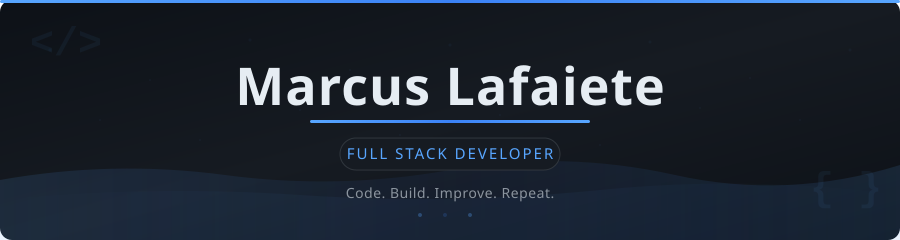
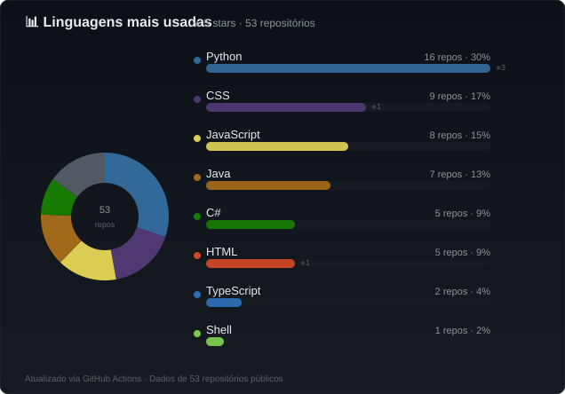
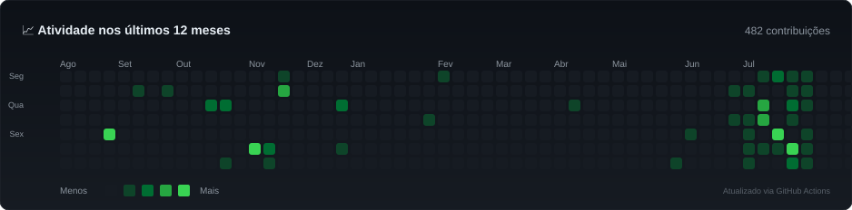

  

  
  &nbsp;
  
  

<!-- ===== BIO CARD ===== -->

<table align="center">
  <tr>
    <td align="center" style="background: #161b22; border: 1px solid #30363d; border-radius: 10px; padding: 20px 30px;">
      <table>
        <tr>
          <td valign="middle" style="padding-right: 16px; font-size: 28px;">👋</td>
          <td valign="middle" style="font-family: -apple-system, BlinkMacSystemFont, 'Segoe UI', sans-serif;">
            <b style="font-size: 16px; color: #e6edf3;">Desenvolvedor Full Stack</b> 
            
              Java · Spring Boot · React · TypeScript · PostgreSQL
             
            
              🇧🇷 Brasil — Transformando ideias em código limpo e soluções escaláveis
            
          </td>
        </tr>
      </table>
    </td>
  </tr>
</table>

 

<!-- ===== TECH STACK ===== -->

## 🛠️ Stack

<table align="center">
  <tr>
    <td align="center" width="80" style="background: #161b22; border: 1px solid #21262d; border-radius: 6px; padding: 4px 0;"><strong>🎨 Frontend</strong></td>
    <td style="background: #161b22; border: 1px solid #21262d; border-radius: 6px; padding: 8px 12px;">
      
      
      
      
      
    </td>
  </tr>
  <tr>
    <td align="center" width="80" style="background: #161b22; border: 1px solid #21262d; border-radius: 6px; padding: 4px 0;"><strong>⚙️ Backend</strong></td>
    <td style="background: #161b22; border: 1px solid #21262d; border-radius: 6px; padding: 8px 12px;">
      
      
      
      
    </td>
  </tr>
  <tr>
    <td align="center" width="80" style="background: #161b22; border: 1px solid #21262d; border-radius: 6px; padding: 4px 0;"><strong>🗄️ Dados</strong></td>
    <td style="background: #161b22; border: 1px solid #21262d; border-radius: 6px; padding: 8px 12px;">
      
      
      
    </td>
  </tr>
  <tr>
    <td align="center" width="80" style="background: #161b22; border: 1px solid #21262d; border-radius: 6px; padding: 4px 0;"><strong>🔧 DevOps</strong></td>
    <td style="background: #161b22; border: 1px solid #21262d; border-radius: 6px; padding: 8px 12px;">
      
      
      
    </td>
  </tr>
</table>

 

<!-- ===== FEATURED PROJECTS ===== -->

## 📌 Projetos

<table>
  <tr>
    <td width="50%" valign="top" style="background: #161b22; border: 1px solid #30363d; border-radius: 10px; padding: 16px;">

### 🔗 Encurtador de URLs
> URL shortener com métricas, cache Redis, QR codes e autenticação via API key.

**Destaques:** Cache distribuído · QR Code · Rate limiting · Dashboard

    </td>
    <td width="50%" valign="top" style="background: #161b22; border: 1px solid #30363d; border-radius: 10px; padding: 16px;">

### 🌤️ Weather Dashboard
> Dashboard interativo com gráficos Recharts, tema dark/light e previsão por geolocalização.

**Destaques:** Previsão 7 dias · Gráficos interativos · Geocoding · Testes

    </td>
  </tr>
  <tr>
    <td valign="top" style="background: #161b22; border: 1px solid #30363d; border-radius: 10px; padding: 16px;">

### 🔧 Minimal API
> API RESTful em ASP.NET Core com JWT, FluentValidation e testes automatizados.

**Destaques:** CRUD · JWT Bearer · Validação · Testes de integração

    </td>
    <td valign="top" style="background: #161b22; border: 1px solid #30363d; border-radius: 10px; padding: 16px;">

### 💬 ForumHub API
> API de fórum com Spring Security, JWT, Flyway migrations e roles ADMIN/USER.

**Destaques:** Autenticação · Roles · Migrations · Docker

    </td>
  </tr>
</table>

 

<!-- ===== GITHUB STATS ===== -->

## 📊 GitHub

<table align="center">
  <tr>
    <td align="center" style="background: #161b22; border: 1px solid #30363d; border-radius: 10px; padding: 20px;">
      <table>
        <tr>
          <td align="center" valign="middle" style="padding-right: 12px;">
            
          </td>
          <td align="center" valign="middle" style="padding-left: 12px;">
            
          </td>
        </tr>
      </table>
       
      

        
<b>📈 Atividade nos últimos 12 meses</b>

         
        
      

    </td>
  </tr>
</table>

 

<!-- ===== FOCUS AREAS ===== -->

## 🎯 Foco Atual

<table align="center">
  <tr>
    <td width="33%" valign="top" style="background: #161b22; border: 1px solid #30363d; border-radius: 10px; padding: 18px; text-align: center;">
      
📖

      <b style="color: #e6edf3; font-size: 15px;">Estudando</b>
      

      

        Spring Security & JWT 
        Docker & Containers 
        React Query · TypeScript
      

    </td>
    <td width="33%" valign="top" style="background: #161b22; border: 1px solid #30363d; border-radius: 10px; padding: 18px; text-align: center;">
      
🚧

      <b style="color: #e6edf3; font-size: 15px;">Construindo</b>
      

      

        APIs RESTful com Java/Spring 
        Dashboards React + TypeScript 
        → Projeto full stack completo
      

    </td>
    <td width="33%" valign="top" style="background: #161b22; border: 1px solid #30363d; border-radius: 10px; padding: 18px; text-align: center;">
      
🎯

      <b style="color: #e6edf3; font-size: 15px;">Meta</b>
      

      

        Arquitetura limpa 
        Open Source 
        Aplicações escaláveis
      

    </td>
  </tr>
</table>

 

<!-- ===== CONTACT ===== -->

<table align="center">
  <tr>
    <td align="center" style="background: #161b22; border: 1px solid #30363d; border-radius: 10px; padding: 20px;">
      Vamos construir algo juntos?  
      
      &nbsp;
      
        
      
        <i>Code. Build. Improve. Repeat.</i>
        &nbsp;·&nbsp; README atualizado via GitHub Actions 🔄
      
    </td>
  </tr>
</table>
